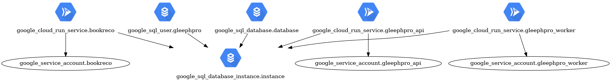

# Him Terraform


## Introduction ✨

This repository is the Him GCP infrastructure as code with [Terraform](https://www.terraform.io).

If you don't know what Terraform is please watch [Terraform in 100 seconds](https://youtu.be/tomUWcQ0P3k).

If you don't know much about Terraform and want to participate to this project, please [watch this 2h video](https://youtu.be/7xngnjfIlK4) and [Let's deploy to production](https://youtu.be/5p8wTOr8AbU). Then you will be welcome on board 🙂

⚠️ **Important:** you will need a [Terraform Cloud](https://app.terraform.io/session) account associated to Him project to use this Project.

## Inframap


## Setup 🚀

Please install [Terraform](https://developer.hashicorp.com/terraform/tutorials/aws-get-started/install-cli).


## Example 💻

Let's say you want to add a new bucket to store kittens pictures.

1. First, you have to login to Terraform Cloud:

   ```bash
   terraform login
   ```
   **Note**: you should only have to do this once.

2. Now let's write some HCL to our Terraform module in `modules/him/bucket.tf`:
   
   ```hcl
   # Bucket for kitties assets
   resource "google_storage_bucket" "kitties-medias" {
      name     = "him-kitties-media-${var.stage}"
      location = "EU"
   }
   ```

3. Provisioning:

   Now you want to try your new bucket in dev?

   ```bash
   cd environements/dev

   # To see the bucket you're about to create
   terraform plan

   # To create your new bucket
   terraform apply
   ```
   
   You are happy with your bucket in dev and would like to have it in prod too?

   ```bash
   cd environements/prod
   terraform apply
   ```


## Enabling Google APIs

For many reasons, Google APIs are not in the Terraform ressources. If it's a new project you will have to enable the APIs manually:

```bash
gcloud config set project him

gcloud services enable \
  cloudbuild.googleapis.com \
  run.googleapis.com \
  cloudresourcemanager.googleapis.com \
  compute.googleapis.com \
  secretmanager.googleapis.com \
  artifactregistry.googleapis.com \
  cloudscheduler.googleapis.com \
  sqladmin.googleapis.com
```


## Terraform Cloud & Backend

Don't trust users, trust code. That's why this project uses Terraform Cloud, this way the Terraform state is
stored into Terraform Cloud and not on a GCP bucket someone might delete...


## Lint & Doc 📚

Before pushing your commits to gitlab please run:

```bash
terraform fmt
```


## Database access 💾

If you need to connect to the database, please use [cloud_sql_proxy](https://cloud.google.com/sql/docs/mysql/sql-proxy?hl=fr#install) instead of giving it a public access (for obvious reasons).

```
cloud_sql_proxy -instances=him:europe-west3:him-dev=tcp:5432
```

Then connect to it via Pgadmin or whatever on localhost.


## Generating ingfra graph 📊

```bash
make graph
```